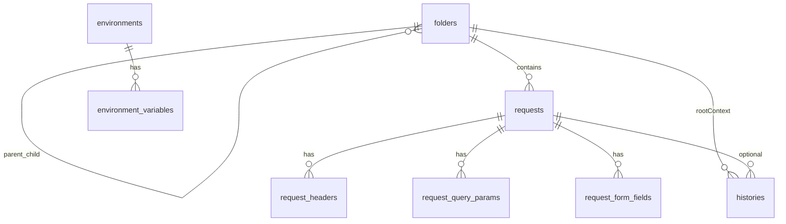

# Data model & trạng thái triển khai (PostmanJanai)

## Mục đích file này

- **Cấu trúc DB** (bảng, cột, FK, ERD) và **migration** / `PRAGMA user_version`.
- **Checklist kỹ thuật** đã / chưa làm — *Tiến độ đã triển khai* và *Todos* ở cuối file.

**Roadmap** (mục tiêu, phase 0–5, backlog): [roadmap.md](roadmap.md) (cùng thư mục `.cursor/plans/`).

---

## Nguyên tắc

- **Bước 0 (bắt buộc):** thống nhất **cấu trúc bảng/cột/ràng buộc** dưới đây; chỉ sau khi bạn “sign-off” mới:
  - chỉnh `ent/schema/*.go` + `go generate`,
  - cập nhật `internal/entity`, repository/usecase,
  - nối UI / HTTP executor.
- **PK / FK:** dùng **UUID** (Ent `field.UUID`), không dùng `int` autoincrement cho bảng domain mới.
- **Thời gian:** `created_at` / `updated_at` — `datetime` (Ent `time.Time`).
- **Folder — tên không trùng trong cùng scope cha:** `UNIQUE (parent_id, name)`; **folder gốc** (`parent_id IS NULL`): không trùng tên giữa các root (enforce thêm ở usecase vì SQLite xử lý NULL trong UNIQUE).
- **Xóa folder:** đệ quy ở repository — xóa folder con trước, request trong từng folder, rồi folder; không còn bảng `workspaces` / `collections` tách biệt.
- **Environment sets:** scope **global app** (không gắn folder ở giai đoạn này; có thể mở rộng sau).
- **Secret storage (giai đoạn hiện tại):** lưu giá trị env **plain text** trong SQLite local.

### Thay đổi mô hình (2026-04 — **DB v3**)

- **Trước (v2):** `workspaces` → `collections` → `requests` (`workspace_id` + `collection_id` tùy chọn).
- **Sau (v3):** chỉ **`folders`** (cây tự tham chiếu `parent_id`) + **`requests.folder_id`** bắt buộc.
- **History:** `root_folder_id` (FK → folder gốc) thay cho `workspace_id` — ngữ nghĩa: folder đang chọn trên sidebar khi gửi (context lịch sử).

---

## Bảng và quan hệ (hiện tại trong code)

### `folders`

Thay thế **workspace + collection**: một bảng, cây lồng nhau.

| Cột | Kiểu | Ràng buộc |
|-----|------|-----------|
| `id` | UUID (TEXT) | PK |
| `parent_id` | UUID (TEXT) | NULL = **folder gốc** (hiển thị như hàng đầu sidebar); NOT NULL = con của folder cha |
| `name` | TEXT | NOT NULL |
| `description` | TEXT | NOT NULL, default `''` |
| `created_at` | DATETIME | NOT NULL |

- **UNIQUE** (`parent_id`, `name`) — tên không trùng giữa các folder cùng cấp (cùng parent).
- **Edge Ent:** `parent` / `children` (self-reference), `requests`, `histories` (root context).

### `requests`

Mỗi request đã lưu thuộc **đúng một** folder.

| Cột | Kiểu | Ràng buộc |
|-----|------|-----------|
| `id` | UUID | PK |
| `folder_id` | UUID | NOT NULL, FK → `folders.id` |
| `name` | TEXT | NOT NULL |
| `method` | TEXT | NOT NULL, default `GET` |
| `url` | TEXT | NOT NULL |
| `body_mode` | TEXT | NOT NULL — enum logic app: `none`, `raw`, `xml`, `form_urlencoded`, `multipart`, … |
| `raw_body` | TEXT | NULL |
| `created_at` | DATETIME | NOT NULL |
| `updated_at` | DATETIME | NOT NULL |

- **UNIQUE** (`folder_id`, `name`) — tên request không trùng trong cùng folder.

### `request_headers`

| Cột | Kiểu | Ràng buộc |
|-----|------|-----------|
| `id` | TEXT | PK, UUID |
| `request_id` | TEXT | NOT NULL, FK → `requests.id` CASCADE |
| `key` | TEXT | NOT NULL |
| `value` | TEXT | NOT NULL |
| `enabled` | BOOLEAN | NOT NULL, default true |
| `sort_order` | INTEGER | NOT NULL, default 0 |

- Index: (`request_id`, `sort_order`).

### `request_query_params`

| Cột | Kiểu | Ràng buộc |
|-----|------|-----------|
| `id` | TEXT | PK, UUID |
| `request_id` | TEXT | NOT NULL, FK → `requests.id` CASCADE |
| `key` | TEXT | NOT NULL |
| `value` | TEXT | NOT NULL |
| `enabled` | BOOLEAN | NOT NULL, default true |
| `sort_order` | INTEGER | NOT NULL, default 0 |

### `request_form_fields` (form-urlencoded & form-data tối giản)

| Cột | Kiểu | Ràng buộc |
|-----|------|-----------|
| `id` | TEXT | PK, UUID |
| `request_id` | TEXT | NOT NULL, FK → `requests.id` CASCADE |
| `field_kind` | TEXT | NOT NULL — `urlencoded` \| `multipart_text` \| `multipart_file` (theo code) |
| `key` | TEXT | NOT NULL |
| `value` | TEXT | NULL |
| `enabled` | BOOLEAN | NOT NULL, default true |
| `sort_order` | INTEGER | NOT NULL, default 0 |

### `histories` (khi **Send** HTTP)

**Quy tắc sản phẩm:**

- **Có** insert khi người dùng **Send** (kể cả lỗi transport / đọc body).
- **Không** ghi khi chỉ CRUD folder/request/env hoặc chưa gửi.

**Gắn entity:**

- `request_id` NULL = ad-hoc; NOT NULL = gửi từ saved request.
- `root_folder_id` NULL/optional = không gắn context folder gốc; NOT NULL = folder gốc đang chọn (sidebar) khi gửi — dùng để filter/gom history theo “space” đang làm việc.

| Cột | Kiểu | Ràng buộc |
|-----|------|-----------|
| `id` | TEXT | PK, UUID |
| `root_folder_id` | TEXT | NULL, FK → `folders.id` *(folder có `parent_id` NULL — ngữ nghĩa app; không enforce bằng CHECK trong schema tối thiểu)* |
| `request_id` | TEXT | NULL, FK → `requests.id` |
| `method` | TEXT | NOT NULL |
| `url` | TEXT | NOT NULL |
| `status_code` | INTEGER | NOT NULL |
| `duration_ms` | INTEGER | NULL |
| `response_size_bytes` | INTEGER | NULL |
| `request_headers_json` | TEXT | NULL |
| `response_headers_json` | TEXT | NULL |
| `request_body` | TEXT | NULL |
| `response_body` | TEXT | NULL |
| `created_at` | DATETIME | NOT NULL |

**Wails / UI:** payload gửi `root_folder_id` (thay `workspace_id`); optional `request_id` khi mở saved request.

### `environments` (global sets)

| Cột | Kiểu | Ràng buộc |
|-----|------|-----------|
| `id` | TEXT | PK, UUID |
| `name` | TEXT | NOT NULL, **UNIQUE** |
| `description` | TEXT | NOT NULL, default `''` |
| `is_active` | BOOLEAN | NOT NULL, default false |
| `created_at` | DATETIME | NOT NULL |
| `updated_at` | DATETIME | NOT NULL |

### `environment_variables`

| Cột | Kiểu | Ràng buộc |
|-----|------|-----------|
| `id` | TEXT | PK, UUID |
| `environment_id` | TEXT | NOT NULL, FK → `environments.id` CASCADE |
| `key` | TEXT | NOT NULL |
| `value` | TEXT | NOT NULL |
| `enabled` | BOOLEAN | NOT NULL, default true |
| `sort_order` | INTEGER | NOT NULL, default 0 |
| `created_at` | DATETIME | NOT NULL |
| `updated_at` | DATETIME | NOT NULL |

- **UNIQUE** (`environment_id`, `key`).

---

## Diễn giải ERD (tóm tắt)

---

## Migration & phiên bản DB

- **`PRAGMA user_version` hiện tại (code):** **`3`** (`internal/constant/app_constant.go` → `DBSchemaUserVersion`).
- **Luồng migrate:** backup DB (nếu non-empty) → `MigrateDataBetweenVersions` → `ent.Client.Schema.Create` → set `user_version`.
- **Các bước đã định nghĩa:**
  - `0 → 1`: placeholder.
  - `1 → 2`: drop bảng legacy (int PK) rồi recreate schema UUID (workspaces, collections, requests, …).
  - `2 → 3`: drop lại toàn bộ bảng domain có trong `dropLegacyTablesForUUIDSchema` (thêm `folders`), rồi `Schema.Create` — **mô hình mới folder + `requests.folder_id` + `histories.root_folder_id`**. **Không** có export/import tự động từ v2: dữ liệu cũ mất sau migrate (có file backup trong `AppDir/backups/` nếu backup chạy).
- Nếu cần **giữ dữ liệu** khi nâng v2→v3: thêm bước export JSON / SQL trong `data_migrate` hoặc job sau `Schema.Create` (todo sản phẩm).

---

## Trạng thái (schema)

- **Schema Ent** khớp các bảng trên (folder, request, history, …); **không** còn entity `workspace` / `collection` trong `ent/schema`.
- **Wails:** `FolderHandler`, `SavedRequestHandler`, `HTTPHandler`, `HistoryHandler` — binding đã generate trong `frontend/wailsjs/`.

---

## DB & migration (ghi nhận kỹ thuật — cập nhật)

- **`histories`:** cột **`root_folder_id`** thay **`workspace_id`** từ DB v3.
- **HTTP execute:** DTO `root_folder_id` (JSON) thay `workspace_id`.
- **Saved request:** `SavedRequestFull.folder_id` duy nhất (bỏ `workspace_id` / `collection_id`).

---

## Tiến độ đã triển khai (cập nhật 2026-04)

- **Roadmap:** Phase **0**, **1**, **2** được coi là **đã đóng** — xem [roadmap.md](roadmap.md).

### Đã xong (Phase 1 + Phase 2)

- [x] Ent schema + generate — **v3: `folders`, `requests` + `folder_id`, `histories` + `root_folder_id`**
- [x] Migrate / backup — bump **2→3** (drop domain tables + recreate)
- [x] **HTTP executor** + Wails `HTTPHandler` (Execute, PickFile, ImportFromCurl)
- [x] **UI:** Request / Response / Console; History tab; **Folders** tab: root folders + **cây folder/request đệ quy**
- [x] **FolderHandler:** root CRUD + `ListChildFolders`
- [x] **SavedRequestHandler:** CRUD + `ListByFolder` + `Get`; RequestPanel load/save + `root_folder_id` / `request_id` khi Send
- [x] **Test data / repo hygiene** như trước

### Chưa làm / backlog

- [ ] **Environments + biến:** CRUD, một env active, resolve `{{var}}` trước khi gửi
- [ ] **Import collection** (Postman/OpenAPI) — map vào folder tree
- [ ] **History chi tiết:** UI snapshot từ một dòng history
- [ ] **Migrate v2→v3 giữ dữ liệu** (nếu cần) — hiện path là **drop**
- [ ] **Polish** cây folder (expand/collapse, DnD, …)

---

# Todos (checklist)

- [x] Sign-off schema (folder + request — đã triển khai v3)
- [x] Ent schema + generate (`folders`, cập nhật `requests` / `histories`)
- [x] Migrate + backup (bump v3; drop — chưa migrate giữ dữ liệu v2)
- [x] HTTP executor & UI (core)
- [x] History: persist + list + `root_folder_id` từ UI
- [x] Import request từ cURL
- [x] **Folder + saved request:** repository, usecase, Wails, UI cây
- [ ] Thêm / hoàn thiện **environments** + **environment_variables** (usecase + UI)
- [ ] Quy tắc active env duy nhất + resolve `{{var}}`
- [ ] Import **collection** (file / clipboard) vào folder tree
- [ ] (Tùy chọn) **Export/import** khi nâng DB v2→v3 để không mất data

---

## Đề xuất bước tiếp theo

Bảng ưu tiên chi tiết: [roadmap.md](roadmap.md) (mục **Đề xuất bước tiếp theo**). Tóm tắt: History chi tiết UI → Environments + `{{var}}` → Auth → Import collection → (optional) migrate giữ dữ liệu v2→v3.
