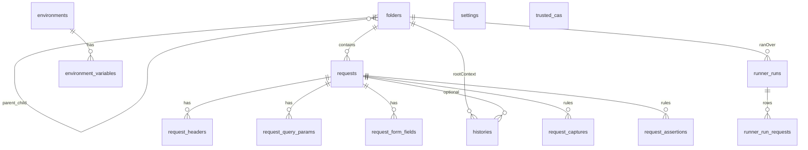

# Data model & trạng thái triển khai (PostmanJanai)

## Mục đích file này

- **Cấu trúc DB** (bảng, cột, FK, ERD) và **migration** / `PRAGMA user_version`.
- **Checklist kỹ thuật** đã / chưa làm — *Tiến độ đã triển khai* và *Todos* ở cuối file.

**Roadmap** (mục tiêu, phase 0–9, backlog): [roadmap.md](roadmap.md) (cùng thư mục `.cursor/plans/`).

> **Phase 6–9 (snapshot — Phase 9 closed 2026-04-30):**
> - **Phase 6 — Networking & Security:** **Done (2026-04-21).** proxy (`none/system/manual` + `NO_PROXY`) + custom CA pool (`trusted_cas` PEM trong DB) + `insecure_skip_verify` (per-request, lưu trên `requests`) + secret env var (`kind` + AES-GCM `enc:v1:` + redact history/snippet) + Wails `SettingsHandler` + tab **Settings**. DB bump **v5 → v6**.
> - **Phase 7 — UX Polish:** **Done (2026-04-26).** Dashboard khi không còn tab + cho đóng tab cuối, in-app Help `?`, Ctrl+K palette, var preview, duplicate folder/request, Copy as cURL, shortcuts, Vite code splitting. **Không** bump DB.
> - **Phase 8 — Runner & Chaining:** **Done (2026-04-26, closed 8.0 + 8.1).** 8.0: capture rules (JSONPath/regex/header/status → env hoặc memory) + assertion rules (status/header/json-path/duration/size/regex, op eq/neq/contains/exists/...) + Collection Runner theo folder + env (persist run + per-request rows + Wails event stream + export JSON/Markdown) + DB bump **v6 → v7**. 8.1: lưu raw resolved request/response trong `runner_run_requests` (5 cột mới) + Runner options Iterations / DelayMs / TimeoutPerRequestMs + DB bump **v7 → v8**.
> - **Phase 9 — Scripting:** **Done (2026-04-30).** goja + sandbox + subset `pmj` / `pm` alias; pre-request & post-response; Runner + Postman script import/export `event[]`; **`HTTPExecuteInput` script overlays** cho Send; khôi phục tab sau restart (hydrate sau async RequestPanel); DB bump **v8 → v9** (`requests.pre_request_script`, `requests.post_response_script`, additive idempotent migration).
>
> Xem scope chi tiết + "Done when" trong từng section `Phase 6/7/8/9` của `roadmap.md`.

---

## Nguyên tắc

- **Bước 0 (bắt buộc):** thống nhất **cấu trúc bảng/cột/ràng buộc** dưới đây; chỉ sau khi bạn “sign-off” mới:
  - chỉnh `ent/schema/*.go` + `go generate`,
  - cập nhật `internal/entity`, repository/usecase,
  - nối UI / HTTP executor.
- **PK / FK:** dùng **UUID** (Ent `field.UUID`), không dùng `int` autoincrement cho bảng domain mới.
- **Thời gian:** `created_at` / `updated_at` — `datetime` (Ent `time.Time`).
- **Folder — tên không trùng trong cùng scope cha:** `UNIQUE (parent_id, name)`; **folder gốc** (`parent_id IS NULL`): không trùng tên giữa các root (enforce thêm ở usecase vì SQLite xử lý NULL trong UNIQUE).
- **Xóa folder:** đệ quy ở repository — xóa folder con trước, request trong từng folder, rồi folder; không còn bảng `workspaces` / `collections` tách biệt.
- **Environment sets:** scope **global app** (toàn bộ app dùng chung một bộ env; app desktop local-only).

### Thay đổi mô hình (2026-04 — **DB v3**)

- **Trước (v2):** `workspaces` → `collections` → `requests` (`workspace_id` + `collection_id` tùy chọn).
- **Sau (v3):** chỉ **`folders`** (cây tự tham chiếu `parent_id`) + **`requests.folder_id`** bắt buộc.
- **History:** `root_folder_id` (FK → folder gốc) thay cho `workspace_id` — ngữ nghĩa: folder đang chọn trên sidebar khi gửi (context lịch sử).

---

## Bảng và quan hệ (hiện tại trong code)

### `folders`

Thay thế **workspace + collection**: một bảng, cây lồng nhau.

| Cột | Kiểu | Ràng buộc |
|-----|------|-----------|
| `id` | UUID (TEXT) | PK |
| `parent_id` | UUID (TEXT) | NULL = **folder gốc** (hiển thị như hàng đầu sidebar); NOT NULL = con của folder cha |
| `name` | TEXT | NOT NULL |
| `description` | TEXT | NOT NULL, default `''` |
| `sort_order` | INTEGER | NOT NULL, default `0` — thứ tự hiển thị trong cùng parent (sidebar); reorder qua DnD / `ReorderFolder` (DB **v5**). |
| `created_at` | DATETIME | NOT NULL |

- **UNIQUE** (`parent_id`, `name`) — tên không trùng giữa các folder cùng cấp (cùng parent).
- **Edge Ent:** `parent` / `children` (self-reference), `requests`, `histories` (root context).

### `requests`

Mỗi request đã lưu thuộc **đúng một** folder.

| Cột | Kiểu | Ràng buộc |
|-----|------|-----------|
| `id` | UUID | PK |
| `folder_id` | UUID | NOT NULL, FK → `folders.id` |
| `name` | TEXT | NOT NULL |
| `method` | TEXT | NOT NULL, default `GET` |
| `url` | TEXT | NOT NULL |
| `body_mode` | TEXT | NOT NULL — enum logic app: `none`, `raw`, `xml`, `form_urlencoded`, `multipart`, … |
| `raw_body` | TEXT | NULL |
| `auth_json` | TEXT | NULL — JSON cấu hình auth (`none` / `bearer` / `basic` / `apikey`), optional |
| `insecure_skip_verify` | BOOLEAN | NOT NULL, default `false` — khi `true`, request đã lưu gửi HTTPS với `InsecureSkipVerify` (badge **insec** trên tab + history) |
| `created_at` | DATETIME | NOT NULL |
| `updated_at` | DATETIME | NOT NULL |

- **UNIQUE** (`folder_id`, `name`) — tên request không trùng trong cùng folder.

### `request_headers`

| Cột | Kiểu | Ràng buộc |
|-----|------|-----------|
| `id` | TEXT | PK, UUID |
| `request_id` | TEXT | NOT NULL, FK → `requests.id` CASCADE |
| `key` | TEXT | NOT NULL |
| `value` | TEXT | NOT NULL |
| `enabled` | BOOLEAN | NOT NULL, default true |
| `sort_order` | INTEGER | NOT NULL, default 0 |

- Index: (`request_id`, `sort_order`).

### `request_query_params`

| Cột | Kiểu | Ràng buộc |
|-----|------|-----------|
| `id` | TEXT | PK, UUID |
| `request_id` | TEXT | NOT NULL, FK → `requests.id` CASCADE |
| `key` | TEXT | NOT NULL |
| `value` | TEXT | NOT NULL |
| `enabled` | BOOLEAN | NOT NULL, default true |
| `sort_order` | INTEGER | NOT NULL, default 0 |

### `request_form_fields` (form-urlencoded & form-data tối giản)

| Cột | Kiểu | Ràng buộc |
|-----|------|-----------|
| `id` | TEXT | PK, UUID |
| `request_id` | TEXT | NOT NULL, FK → `requests.id` CASCADE |
| `field_kind` | TEXT | NOT NULL — `urlencoded` \| `multipart_text` \| `multipart_file` (theo code) |
| `key` | TEXT | NOT NULL |
| `value` | TEXT | NULL |
| `enabled` | BOOLEAN | NOT NULL, default true |
| `sort_order` | INTEGER | NOT NULL, default 0 |

### `histories` (khi **Send** HTTP)

**Quy tắc sản phẩm:**

- **Có** insert khi người dùng **Send** (kể cả lỗi transport / đọc body).
- **Không** ghi khi chỉ CRUD folder/request/env hoặc chưa gửi.

**Gắn entity:**

- `request_id` NULL = ad-hoc; NOT NULL = gửi từ saved request.
- `root_folder_id` NULL/optional = không gắn context folder gốc; NOT NULL = folder gốc đang chọn (sidebar) khi gửi — dùng để filter/gom history theo “space” đang làm việc.

| Cột | Kiểu | Ràng buộc |
|-----|------|-----------|
| `id` | TEXT | PK, UUID |
| `root_folder_id` | TEXT | NULL, FK → `folders.id` *(folder có `parent_id` NULL — ngữ nghĩa app; không enforce bằng CHECK trong schema tối thiểu)* |
| `request_id` | TEXT | NULL, FK → `requests.id` |
| `method` | TEXT | NOT NULL |
| `url` | TEXT | NOT NULL |
| `status_code` | INTEGER | NOT NULL |
| `duration_ms` | INTEGER | NULL |
| `response_size_bytes` | INTEGER | NULL |
| `request_headers_json` | TEXT | NULL |
| `response_headers_json` | TEXT | NULL |
| `request_body` | TEXT | NULL |
| `response_body` | TEXT | NULL |
| `created_at` | DATETIME | NOT NULL |

**Wails / UI:** payload gửi `root_folder_id` (thay `workspace_id`); optional `request_id` khi mở saved request.

### `environments` (global sets)

| Cột | Kiểu | Ràng buộc |
|-----|------|-----------|
| `id` | TEXT | PK, UUID |
| `name` | TEXT | NOT NULL, **UNIQUE** |
| `description` | TEXT | NOT NULL, default `''` |
| `is_active` | BOOLEAN | NOT NULL, default false |
| `created_at` | DATETIME | NOT NULL |
| `updated_at` | DATETIME | NOT NULL |

### `environment_variables`

| Cột | Kiểu | Ràng buộc |
|-----|------|-----------|
| `id` | TEXT | PK, UUID |
| `environment_id` | TEXT | NOT NULL, FK → `environments.id` CASCADE |
| `key` | TEXT | NOT NULL |
| `value` | TEXT | NOT NULL — nếu `kind=secret` thì value trong DB là ciphertext có prefix `enc:v1:` (AES-GCM) |
| `kind` | TEXT | NOT NULL, default `plain` — `plain` \| `secret` |
| `enabled` | BOOLEAN | NOT NULL, default true |
| `sort_order` | INTEGER | NOT NULL, default 0 |
| `created_at` | DATETIME | NOT NULL |
| `updated_at` | DATETIME | NOT NULL |

- **UNIQUE** (`environment_id`, `key`).

### `settings` (key/value — Phase 6)

Bảng nhỏ dạng “feature flags / config” cho proxy (và có thể mở rộng sau).

| Cột | Kiểu | Ràng buộc |
|-----|------|-----------|
| `key` | TEXT | PK |
| `value` | TEXT | NOT NULL |

**Keys hiện dùng (proxy):** `proxy.mode`, `proxy.url`, `proxy.username`, `proxy.password` (ciphertext), `proxy.no_proxy`.

### `trusted_cas` (custom CA PEM — Phase 6)

| Cột | Kiểu | Ràng buộc |
|-----|------|-----------|
| `id` | UUID | PK |
| `label` | TEXT | NOT NULL |
| `pem_content` | TEXT | NOT NULL |
| `enabled` | BOOLEAN | NOT NULL, default true |
| `created_at` | DATETIME | NOT NULL |

### `request_captures` (Phase 8 — post-response capture rules)

Mỗi rule extract một giá trị từ response của request và ghi vào env hoặc memory bag.

| Cột | Kiểu | Ràng buộc |
|-----|------|-----------|
| `id` | UUID | PK |
| `request_id` | UUID | NOT NULL, FK → `requests.id` CASCADE |
| `name` | TEXT | NOT NULL — nhãn hiển thị, cũng dùng để debug |
| `source` | TEXT | NOT NULL — `json_body` \| `header` \| `status` \| `regex_body` |
| `expression` | TEXT | NOT NULL, default `''` — JSONPath / header name / regex; rỗng cho `status` |
| `target_scope` | TEXT | NOT NULL — `environment` (ghi env active qua `UpsertActiveVariable`) \| `memory` (chỉ trong run hiện tại) |
| `target_variable` | TEXT | NOT NULL — tên biến đích |
| `enabled` | BOOLEAN | NOT NULL, default true |
| `sort_order` | INTEGER | NOT NULL, default 0 |
| `created_at` | DATETIME | NOT NULL |
| `updated_at` | DATETIME | NOT NULL |

### `request_assertions` (Phase 8 — post-response assertion rules)

| Cột | Kiểu | Ràng buộc |
|-----|------|-----------|
| `id` | UUID | PK |
| `request_id` | UUID | NOT NULL, FK → `requests.id` CASCADE |
| `name` | TEXT | NOT NULL |
| `source` | TEXT | NOT NULL — `status` \| `header` \| `json_body` \| `regex_body` \| `duration_ms` \| `response_size_bytes` |
| `expression` | TEXT | NOT NULL, default `''` — JSONPath / header name / regex |
| `operator` | TEXT | NOT NULL — `eq` \| `neq` \| `contains` \| `not_contains` \| `gt` \| `lt` \| `gte` \| `lte` \| `regex` \| `exists` \| `not_exists` |
| `expected` | TEXT | NOT NULL, default `''` |
| `enabled` | BOOLEAN | NOT NULL, default true |
| `sort_order` | INTEGER | NOT NULL, default 0 |
| `created_at` | DATETIME | NOT NULL |
| `updated_at` | DATETIME | NOT NULL |

### `runner_runs` (Phase 8 — header cho mỗi lần chạy folder)

| Cột | Kiểu | Ràng buộc |
|-----|------|-----------|
| `id` | UUID | PK |
| `folder_id` | UUID | NULL — folder gốc của lần run (NULL nếu folder bị xoá sau đó) |
| `folder_name` | TEXT | NOT NULL — snapshot tên folder lúc chạy (giữ report đọc được dù folder bị đổi tên) |
| `environment_id` | UUID | NULL |
| `environment_name` | TEXT | NOT NULL, default `''` |
| `status` | TEXT | NOT NULL — `running` \| `completed` \| `failed` \| `cancelled` |
| `total_count` / `passed_count` / `failed_count` / `error_count` | INTEGER | NOT NULL, default 0 |
| `duration_ms` | INTEGER | NOT NULL, default 0 |
| `notes` | TEXT | NOT NULL, default `''` — text user nhập ở Runner modal |
| `started_at` | DATETIME | NOT NULL |
| `finished_at` | DATETIME | NULL |

### `runner_run_requests` (Phase 8 — per-request kết quả trong run)

| Cột | Kiểu | Ràng buộc |
|-----|------|-----------|
| `id` | UUID | PK |
| `run_id` | UUID | NOT NULL, FK → `runner_runs.id` CASCADE |
| `request_id` | UUID | NULL — saved request gốc (NULL nếu bị xoá) |
| `request_name` / `method` / `url` | TEXT | NOT NULL |
| `status` | TEXT | NOT NULL — `passed` \| `failed` \| `errored` \| `skipped` |
| `status_code` / `duration_ms` / `response_size_bytes` | INTEGER | NOT NULL, default 0 |
| `error_message` | TEXT | NOT NULL, default `''` |
| `assertions_json` | TEXT | NOT NULL, default `''` — danh sách `AssertionResult` đã JSON-encode |
| `captures_json` | TEXT | NOT NULL, default `''` — danh sách `CaptureResult` đã JSON-encode |
| `request_headers_json` | TEXT | NULL — Phase 8.1; `[]KeyValue` đã resolve `{{var}}` (raw những gì đã gửi) |
| `response_headers_json` | TEXT | NULL — Phase 8.1; raw response headers |
| `request_body` | TEXT | NULL — Phase 8.1; raw request body sau substitution / form encode / multipart text |
| `response_body` | TEXT | NULL — Phase 8.1; raw response body (đã chia sẻ truncate cap với HTTPExecutor) |
| `body_truncated` | BOOLEAN | NOT NULL, default false — cờ để UI hiển thị suffix `[… response body truncated …]` đồng nhất với history |
| `sort_order` | INTEGER | NOT NULL, default 0 — Phase 8.1: với iterations > 1, `iteration*plan_size + idx` để giữ thứ tự thời gian khi xem lại |
| `created_at` | DATETIME | NOT NULL |

---

## Diễn giải ERD (tóm tắt)

---

## Migration & phiên bản DB

- **`PRAGMA user_version` hiện tại (code):** **`8`** (`internal/constant/app_constant.go` → `DBSchemaUserVersion`).
- **Luồng migrate:** backup DB (nếu non-empty) → `MigrateDataBetweenVersions` → `ent.Client.Schema.Create` → set `user_version`.
- **Các bước đã định nghĩa:**
  - `0 → 1`: placeholder.
  - `1 → 2`: drop bảng legacy (int PK) rồi recreate schema UUID (workspaces, collections, requests, …).
  - `2 → 3`: drop lại toàn bộ bảng domain có trong `dropLegacyTablesForUUIDSchema` (thêm `folders`), rồi `Schema.Create` — **mô hình mới folder + `requests.folder_id` + `histories.root_folder_id`**. **Không** có export/import tự động từ v2: dữ liệu cũ mất sau migrate (có file backup trong `AppDir/backups/` nếu backup chạy).
  - `3 → 4`: additive (Ent `Schema.Create`) — ví dụ `requests.auth_json`.
  - `4 → 5`: `ALTER TABLE folders ADD COLUMN sort_order …` + backfill theo tên trong `internal/dbmanage/data_migrate.go` (`backfillFolderSortOrder`).
  - `5 → 6`: additive — `CREATE TABLE settings`, `CREATE TABLE trusted_cas`, `ALTER TABLE environment_variables ADD COLUMN kind …`, `ALTER TABLE requests ADD COLUMN insecure_skip_verify …` (chi tiết trong `internal/dbmanage/data_migrate.go`).
  - `6 → 7`: **additive** — `CREATE TABLE request_captures`, `CREATE TABLE request_assertions`, `CREATE TABLE runner_runs`, `CREATE TABLE runner_run_requests` (Phase 8.0). Tất cả DDL do `ent.Schema.Create` đảm nhiệm; bước migrate chỉ bump `user_version` (không destructive, không backfill). Có test idempotent (`TestMigrate_6to7IsAdditive`) đảm bảo các bảng cũ không bị đụng.
  - `7 → 8`: **additive** — Phase 8.1; `ALTER TABLE runner_run_requests ADD COLUMN` cho 5 cột raw request/response (`request_headers_json`, `response_headers_json`, `request_body`, `response_body`, `body_truncated`). Idempotent: rerun trên DB đã có cột chỉ no-op (helper `isDuplicateColumnErr`). Test: `TestMigrate_7to8AddsRunnerRequestSnapshots` (đơn lẻ) + `TestMigrate_6to8Chain` (chuỗi liền mạch).
- Nếu cần **giữ dữ liệu** khi nâng v2→v3: thêm bước export JSON / SQL trong `data_migrate` hoặc job sau `Schema.Create` (todo sản phẩm — **backlog**).

---

## Trạng thái (schema)

- **Schema Ent** khớp các bảng trên (folder, request, history, environment, …); **không** còn entity `workspace` / `collection` trong `ent/schema`.
- **Wails:** `FolderHandler` (gồm `MoveFolder`, **`ReorderFolder`**), `SavedRequestHandler` (gồm `MoveRequest`), `HTTPHandler`, `HistoryHandler`, **`EnvironmentHandler`**, **`SettingsHandler` (Phase 6)**, `ImportHandler`, `SearchHandler`, **`ExportHandler`**, **`SnippetHandler`**, **`RuleHandler` (Phase 8 — capture/assertion CRUD)**, **`RunnerHandler` (Phase 8 — `RunFolder`/`CancelRun`/`GetRun`/`ListRecentRuns`/`DeleteRun`/`ExportRunReport`)** — binding trong `frontend/wailsjs/`.

---

## DB & migration (ghi nhận kỹ thuật — cập nhật)

- **`histories`:** cột **`root_folder_id`** thay **`workspace_id`** từ DB v3.
- **HTTP execute:** DTO `root_folder_id` (JSON) thay `workspace_id`.
- **Saved request:** `SavedRequestFull.folder_id` duy nhất (bỏ `workspace_id` / `collection_id`).

---

## Tiến độ đã triển khai (cập nhật 2026-04-21)

- **Roadmap:** Phase **0–3** **đã đóng**; **Phase 4** **đã đóng** theo scope productivity (Import, Multi-tab, Search, export Postman v2.1, snippets, cây folder đầy đủ kể cả reorder + polish UX) — chi tiết [roadmap.md](roadmap.md).
- **Phase 5** **đã đóng** (2026-04-21) — quality gate baseline (tests + smoke E2E Go + CI + release/manual docs).
- **Phase 6** **đã đóng** (2026-04-21) — networking/security: proxy + custom CA + per-request insecure TLS + secret env + redact + Settings UI — **DB v6**.
- **Phase 7** **đã đóng** (2026-04-26) — UX polish/productivity: Dashboard, in-app Help `?`, Ctrl+K palette, variable preview, duplicate folder/request, Copy as cURL, shortcuts, Vite code splitting hết warning chunk > 500 kB — **không bump DB**.
- **Phase 8** **đã đóng** (2026-04-26, gồm 8.0 + 8.1) — Collection Runner & Chaining: capture/assertion engine, runner orchestrator, persist runs, Wails event stream, UI Captures/Tests + Runner modal + ResponsePanel summary, export JSON/Markdown, raw resolved request/response replay, Iterations / DelayMs / TimeoutPerRequestMs options — **DB v7 → v8**.

### Đã xong (Phase 8.1 — Replay & advanced runner options, 2026-04-26)

- [x] **DB v8** — `runner_run_requests` thêm `request_headers_json`, `response_headers_json`, `request_body`, `response_body`, `body_truncated` (Ent schema + migrate v7→v8 additive idempotent + tests).
- [x] **Persist raw request/response** — `RunnerUsecase.executeOne` gọi `applyHTTPSnapshotsToRow` để lưu snapshot post-substitution (kể cả khi executor lỗi: fallback qua `service.HTTPRequestSnapshotsForHistory`); response body có suffix truncate khớp `HTTPHandler.persistHistory`.
- [x] **Runner advanced options** — `RunFolderInput` thêm `Iterations` (≤ `RunnerMaxIterations`=50), `DelayMs` (≤ 60s, cancel-aware qua `sleepCancelable`), `TimeoutPerRequestMs` (≤ 5 phút, override per-Execute bằng `context.WithTimeout`); `total_count` & event `current_idx` reflect `iterations × plan_size`. Constants ở `internal/constant/app_constant.go`.
- [x] **Frontend** — `RunnerModal.vue` thêm 3 input number Iterations / Delay / Timeout (clamp client-side trước khi gửi); `RunnerRequestDetailModal.vue` hiển thị raw headers/body bằng `JsonCodeMirror` + badge truncate; `RunnerModal` re-hydrate progress từ `RunnerAPI.GetRun(id)` sau `runner:finished` để dữ liệu replay luôn trùng DB.
- [x] **HelpModal** — thêm 2 mục mới (Runner options, Runner request detail) trong Productivity Tips.
- [x] **Tests** — `TestRunner_RunFolder_IterationsAndDelay` (3 iter × 2 req = 6 rows + delay floor + sort_order monotonic), `TestRunner_RunFolder_IterationsClampedToMax` (≥ max → `RunnerMaxIterations`), `TestRunner_RunFolder_TimeoutPerRequest` (blocking stub bị huỷ trước default HTTP timeout); `TestMigrate_7to8AddsRunnerRequestSnapshots` (additive + rerun idempotent), `TestMigrate_6to8Chain` (chain v6→v7→v8 trên DB seed sẵn). E2E `phase8_runner_smoke_test` đã có khẳng định raw payload (post-substitution) lưu đúng.

### Đã xong (Phase 8.0 — Collection Runner & Chaining, 2026-04-26)

- [x] **DB v7** — `request_captures`, `request_assertions`, `runner_runs`, `runner_run_requests` (Ent schema + bump `DBSchemaUserVersion` + migrate v6→v7 additive + test idempotent + `TestMigrate_6to7IsAdditive`).
- [x] **Capture engine** — `internal/service/jsonpath.go`, `capture_engine.go` (`json_body` / `header` / `status` / `regex_body`), unit test `jsonpath_test.go` + `capture_engine_test.go`.
- [x] **Assertion engine** — `assertion_engine.go` (sources `status`/`header`/`json_body`/`regex_body`/`duration_ms`/`response_size_bytes`, ops `eq`/`neq`/`contains`/`not_contains`/`gt`/`lt`/`gte`/`lte`/`regex`/`exists`/`not_exists`), unit test `assertion_engine_test.go`.
- [x] **Repositories** — `RequestRuleRepository` (delete-then-create cho captures/assertions, cascade khi xoá request/folder) + `RunnerRepository` (`StartRun` / `AppendRequest` / `UpdateProgress` / `FinishRun` / `GetDetail` / `ListRecent` / `DeleteByID`); test `request_rule_repository_test.go`.
- [x] **HTTP execute integration** — `HTTPHandler.Execute` chạy capture + assertion sau response cho saved request, `HTTPExecuteResult` thêm `Captures` + `Assertions`, captures scope=environment ghi qua `EnvironmentRepository.UpsertActiveVariable`.
- [x] **RunnerUsecase** — `RunFolder` orchestrate (env active map + memory bag chaining; `StopOnFail`; status `completed`/`failed`/`cancelled`); persist run + per-request rows; emit Wails events `runner:started` / `runner:request` / `runner:finished`; test `runner_usecase_test.go`.
- [x] **Wails handlers** — `RuleHandler` (CRUD captures/assertions) + `RunnerHandler` (`RunFolder` async + cancel; `GetRun` / `ListRecentRuns` / `DeleteRun` / `ExportRunReport` JSON+MD via Save dialog) + bindings regenerate.
- [x] **Frontend** — `RequestRulesEditor.vue` (mode captures/assertions trong tab **Captures** + **Tests** trên RequestPanel khi đã save); `ResponsePanel.vue` thêm tab **Tests** + summary pills; `RunnerModal.vue` (config form, live progress, recent runs, cancel, export JSON/Markdown); context menu folder “Run folder…” trong `FolderTreeNode` → `Sidebar` → `App.vue` mở Runner; nút **Runner** trên header App.
- [x] **Report service** — `internal/service/runner_report.go` (`MarshalRunnerRunDetailJSON` + `MarshalRunnerRunDetailMarkdown` truncate 200/600 ký tự, escape pipe cho cell Markdown), test `runner_report_test.go`.
- [x] **Smoke E2E** — `internal/e2e/phase8_runner_smoke_test.go`: capture `$.token` → env active → request kế tiếp gửi `Authorization: Bearer tkn-42`, assertion 2xx + JSON contains, kiểm tra event order `started → request × N → finished`, JSON/Markdown report.
- [x] **`go test ./... -count=1`** xanh (tất cả layer).

### Đã xong (Phase 6 — networking & security, 2026-04-21)

- [x] **DB v6** — `settings`, `trusted_cas`, `environment_variables.kind`, `requests.insecure_skip_verify` + migrate `5→6` + test migration
- [x] **Crypto** — `SecretCipher` AES-GCM (`enc:v1:`) cho proxy password + secret env values
- [x] **HTTP transport** — `HTTPTransportFactory` (system proxy / manual proxy + basic-auth proxy / NO_PROXY + custom CA pool + per-request TLS insecure)
- [x] **Redact** — `RedactHTTPExecuteInput` + history persist dùng snapshot đã redact; snippets dùng payload redact
- [x] **Wails** — `SettingsHandler` (`Get/SetProxy`, `TestProxy`, CRUD CA, `PickCACertFile`, `ReadTextFile`)
- [x] **Frontend** — tab **Settings**; env var `kind=secret` UI; toggle insecure TLS + badge tab/history

### Nhật ký công việc 2026-04-20 (bổ sung trong ngày)

- **DnD:** vùng **Same level** / **Inside** trên hàng folder; root **Top-level** / **Inside**; highlight + strip gợi ý.
- **Reorder:** `folders.sort_order`, **DB v5**, `FolderHandler.ReorderFolder`, khe drop giữa folder (nested + root) và cuối list.
- **UX click:** toggle mở/thu trên **toàn hàng** (padding + `items-stretch`); khe reorder phía trên folder cũng gọi toggle; tránh dead zone mép trên/dưới.
- **Rename folder:** chỉ qua **⋮ → Rename** (nested + root); không double-click folder; request vẫn delayed single-click + double-click rename.

### Đã xong (Phase 1 + Phase 2)

- [x] Ent schema + generate — **v3: `folders`, `requests` + `folder_id`, `histories` + `root_folder_id`**
- [x] Migrate / backup — bump **2→3** (drop domain tables + recreate)
- [x] **HTTP executor** + Wails `HTTPHandler` (Execute, PickFile, ImportFromCurl)
- [x] **UI:** Request / Response / Console; History tab; **Folders** tab: root folders + **cây folder/request đệ quy**
- [x] **FolderHandler:** root CRUD + `ListChildFolders`
- [x] **SavedRequestHandler:** CRUD + `ListByFolder` + `Get`; RequestPanel load/save + `root_folder_id` / `request_id` khi Send
- [x] **Test data / repo hygiene** như trước

### Đã xong (Phase 3)

- [x] **`environments` / `environment_variables`:** Ent + repository + usecase + Wails **`EnvironmentHandler`** (CRUD env, CRUD biến, **một env active**)
- [x] **Substitute `{{var}}`:** `CloneSubstituteHTTPExecuteInput` + gọi từ `HTTPHandler.Execute` **trước** executor (URL, body, headers, query, form, multipart, trường auth)
- [x] **Auth:** `MergeAuthIntoHeadersAndQuery` — bearer / basic / apikey (header hoặc query); lưu **`auth_json`** trên `requests`
- [x] **History:** persist snapshot **đã resolve** (URL/body/headers như gửi thật)
- [x] **UI:** modal / flow **history chi tiết** (xem request/response đã lưu); editor **`{{var}}`** (chip, popover, caret nhảy khối trên CodeMirror + `EnvVarMirrorField`)

### Đã xong (Phase 4 — productivity)

- [x] **Multi-tab request editor** (2026-04-20):
  - **Store:** `frontend/src/stores/tabsStore.js` — reactive singleton (không dùng Pinia). Giữ `tabs: TabState[]` + `activeTabId`; mỗi `TabState` = `{ id, snapshot: RequestSnapshot, baseline: RequestSnapshot, response, loading }`.
  - **Actions:** `openSavedRequest(dto)` (nếu đã mở → activate + refresh snapshot, nếu chưa → tạo tab mới), `openBlank()`, `openAdhocFromPayload(curlPayload)` (tái dùng tab blank hiện tại nếu có), `activateTab(id)`, `closeTab(id)` (auto chọn tab kế cận; tự tạo blank khi đóng tab cuối), `updateActiveSnapshot(snap)`, `markActiveBaseline()`, `promoteActiveToSaved(dto)`, per-tab `setTabResponse(id,*)` / `setTabLoading(id,*)` (đảm bảo response hạ cánh đúng tab kể cả khi user switch tab giữa send).
  - **Persist:** key `pmj.tabs.v1` trong `localStorage`, debounce 200ms; lưu `tabs[i].{id,snapshot,baseline}` + `activeTabId`; **không** persist `response`/`loading` (transient). Trần `MAX_TABS = 20`.
  - **Dirty tracking:** `canonicalForDiff()` strip `activeTab` + `bodyRawEditor` (UI-only) → so sánh JSON giữa `snapshot` và `baseline`. `baseline` được commit khi: tab vừa tạo, mở saved request mới, save/update thành công (qua event `baseline-committed` / `promote-to-saved` từ RequestPanel).
  - **RequestPanel:** thêm `snapshot()` / `hydrate(snap)` qua `defineExpose`; watcher deep debounced 80ms trên toàn bộ reactive state → emit `snapshot-change`. Có cờ `hydrating` + `suppressSnapshotUpdate` (App.vue side) để không ghi đè baseline khi programmatically nạp lại. `saveSavedRequest` emit thêm `baseline-committed`; `submitSaveAdhoc` emit `promote-to-saved(created)`.
  - **UI:** `RequestTabBar.vue` — tab strip có method badge (color theo verb), dirty dot, close button (hover / middle-click), nút `+`, scroll ngang khi nhiều tab, active indicator cam.
  - **Persistence behaviour:** mở lại app → tabs khôi phục kèm nội dung form; **response bị xoá** (ý đồ: kết quả là ephemeral). Nếu user đang dirty, dirty dot vẫn hiện sau restart.
  - **Không đổi backend / schema:** hoàn toàn frontend-side; không thêm Wails handler, không bump `DBSchemaUserVersion`.

- [x] **Import collection** → folder tree (2026-04-20):
  - **Formats:** Postman Collection v2.1, Postman Collection v2.0 (legacy), OpenAPI 3.x (JSON + YAML), Insomnia v4 export (JSON). Auto-detect qua `internal/service/collection_importer.go` (probe JSON keys: `info.schema`, `openapi`, `_type: export`).
  - **Parsers (service):** `postman_v21_importer.go`, `postman_v20_importer.go`, `openapi_importer.go` (YAML → generic tree → JSON re-serialize để giữ `json.RawMessage`), `insomnia_importer.go` — mỗi file có bộ test `*_test.go` tương ứng.
  - **DTO trung gian:** `internal/entity/import_collection.go` — `ImportedCollection` / `ImportedItem` / `ImportedFolder` / `ImportedRequest` / `ImportedVariable` / `ImportOptions` / `ImportResult` (format-agnostic).
  - **Usecase:** `internal/usecase/import_usecase.go` — persist tree theo DFS, tạo **root folder mới luôn** (tên collection, auto rename khi trùng root), sibling trùng tên tự `" (n)"` qua `pickUniqueSiblingName`; tùy chọn tạo environment mới từ `variables` (optional activate).
  - **Delivery Wails:** `internal/delivery/import_handler.go` — `PickCollectionFile`, `PreviewCollectionFile`, `ImportCollectionFile`; wired trong `main.go` (OnStartup).
  - **Limits / errors:** cap file `constant.MaxImportFileBytes` (25 MB); error codes `IMP_701..IMP_707` trong `internal/constant/error_constant.go`.
  - **Frontend:** `frontend/src/components/ImportCollectionModal.vue` (preview tên, format, số folder/request, variables, warnings; option tạo + activate env) + nút **Import** trên sidebar Folders (`Sidebar.vue`); refresh folder tree + env list và toast sau khi import.
  - **DB impact (lúc triển khai):** tái sử dụng bảng `folders` / `requests` / …; các bump sau (`auth_json`, `sort_order`, Phase 6…) xem mục **Migration & phiên bản DB** (hiện **v6**).

- [x] **Inline rename folder + saved request** (2026-04-20 — Phase 4 item #6.2; cập nhật UX cùng ngày):
  - **Folder:** chỉ **⋮ → Rename** → input inline (nested + root); **không** double-click folder; **Enter** / **Esc** / **blur** như trước.
  - **Request:** double-click → input inline; single-click mở tab (delayed ~220ms để tách double-click).
  - Menu ⋮: folder **Rename** (inline) + **Edit folder…** (modal mô tả); request **Rename** dùng inline.
  - `emit('saved-request')` từ tree khi đổi tên request → `Sidebar` forward → `App` `onSavedRequestUpdated` (refresh catalog).
  - **Không đổi backend / schema** (dùng `FolderHandler.UpdateFolder` / `SavedRequestHandler.Update` hiện có).

- [x] **Persist folder tree expand/collapse** (2026-04-20 — Phase 4 item #6.1):
  - `Sidebar.vue` sở hữu `expandedFolderIds` (plain `Record<string, boolean>`) và `rootTreeExpanded`; provide `expandedFolderIds` để mọi `FolderTreeNode` share một trạng thái thay vì mỗi instance tự giữ.
  - Persist vào `localStorage`: `pmj.sidebar.folder-expanded.v1` (nested) và `pmj.sidebar.root-expanded.v1` (root) — debounce 200ms, load trước khi render cây để tránh flicker.
  - Stale ids sau khi xoá folder là vô hại (id không tồn tại chỉ ẩn mục).
  - **Không đổi backend / schema.**

- [x] **Search / filter** (folders, saved requests, history) (2026-04-20):
  - **Backend:** `internal/repository/folder_repository.go` — `SearchByName(ctx, query, limit) ([]*FolderItem, truncated, error)` dùng `folder.NameContainsFold` + `LIMIT n+1` để phát hiện truncate; thêm `ListAllSkeleton(ctx)` (chỉ `id` / `name` / `parent_id`) để tính breadcrumb. `internal/repository/request_repository.go` — `SearchByNameOrURL(ctx, query, limit)` OR `name`/`url` với `ContainsFold`.
  - **Usecase:** `internal/usecase/search_usecase.go` — `SearchTree(query, limit)` ghép folder + request hits, build `path[]` (breadcrumb tên folders từ root) từ skeleton, cycle-safe. Test `search_usecase_test.go` cho `pathForFolder` (root / mid / leaf / sibling / missing / cycle).
  - **Delivery:** `internal/delivery/search_handler.go` — Wails `SearchHandler.SearchTree(query, limit)`; empty query ⇒ empty result để UI fallback về cây thường. Wire trong `main.go`.
  - **Frontend:** `frontend/src/components/HighlightText.vue` (utility bôi match không regex); `Sidebar.vue` bổ sung:
    - Tab **Folders**: ô search đầu panel, debounce 250ms + anti-stale token, render flat list "Folders · n" + "Requests · n" kèm breadcrumb path + highlight; click folder hit ⇒ activate root + expand, click request hit ⇒ `open-saved-request`.
    - Tab **History**: input free-text (URL/method/status substring, highlight trên URL) + filter panel toggle (method chip multi-select, status group 2xx/3xx/4xx/5xx/other, date range `from`/`to`), pure client-side qua `computed filteredHistoryList`; counter `matched / total` + "Clear all".
  - **Giới hạn:** mặc định 100 hit/nhóm, cứng ≤ 500 (`searchMaxLimit`), truncate hiển thị hint cho user.
  - **DB impact:** **không** đổi schema — dùng SQLite `LIKE` qua Ent `*ContainsFold`; ở scale local (thousands) không cần FTS/index phụ.

### Chưa làm / backlog (sau Phase 4)

- [ ] **Export** project JSON “native” / đối xứng đầy đủ Import (tùy chọn — đã có **Postman Collection v2.1** từ root folder)
- [ ] **Migrate v2→v3 giữ dữ liệu** (nếu cần) — hiện path bump cũ là **drop** + backup

### Đã xong (Flow B + polish — 2026-04-20)

- [x] **Export Postman Collection v2.1** — `export_usecase.go` + `ExportHandler.ExportPostmanV21`; UI save dialog từ menu root folder
- [x] **Snippet** curl / fetch / axios / httpie — `SnippetHandler` + resolve env + auth (cùng pipeline Execute)
- [x] **Polish cây folder** — expand/collapse `localStorage`; rename folder qua ⋮; DnD `MoveFolder` / `MoveRequest`; vùng Same/Inside; **reorder** `sort_order` + `ReorderFolder` + **DB v5**; full-row click + khe reorder nhận toggle

---

# Todos (checklist)

- [x] Sign-off schema (folder + request — đã triển khai v3)
- [x] Ent schema + generate (`folders`, cập nhật `requests` / `histories`)
- [x] Migrate + backup (bump v3; drop — chưa migrate giữ dữ liệu v2)
- [x] HTTP executor & UI (core)
- [x] History: persist + list + `root_folder_id` từ UI
- [x] Import request từ cURL
- [x] **Folder + saved request:** repository, usecase, Wails, UI cây
- [x] **Environments** + **environment_variables** (usecase + UI + `EnvironmentHandler`)
- [x] **Active env duy nhất** + **resolve `{{var}}`** trước gửi request
- [x] Import **collection** (file) vào folder tree — Postman v2.1/v2.0, OpenAPI 3.x (JSON+YAML), Insomnia v4 (2026-04-20)
- [x] **Multi-tab** request editor + persist `localStorage` (2026-04-20)
- [x] **Search / filter** folder + saved request + history (2026-04-20)
- [x] **Export** Postman Collection v2.1 (file) — 2026-04-20
- [x] **Snippet** curl / fetch / axios / httpie — 2026-04-20
- [x] **DnD** move folder/request + **reorder** + **DB v5** `sort_order` — 2026-04-20
- [x] **Phase 5** quality gate — tests + smoke E2E + CI + release/manual docs — 2026-04-21
- [x] **Phase 6** networking & security — proxy + custom CA + insecure TLS + secret env + Settings UI — **DB v6** — 2026-04-21
- [x] **Phase 7** UX polish & productivity — Dashboard + in-app Help + command palette + var preview + duplicate + Copy as cURL + shortcuts + Vite code splitting — 2026-04-26
- [x] **Phase 8.0** Collection Runner & Chaining — capture + assertion engines + Runner usecase + Wails events + Runner modal + report JSON/Markdown — **DB v7** — 2026-04-26
- [x] **Phase 8.1** Runner replay + iterations/delay/timeout — raw request/response persist + RunnerRequestDetailModal + 3 advanced options — **DB v8** — 2026-04-26
- [x] **Phase 9** Scripting — goja sandbox + `pmj` / `pm` alias + Pre-request + Post-response + Captures/Assertions strip + Runner + Postman v2.1 import/export + script on Send from editor + tab restore hydrate — **DB v8 → v9** — **closed / docs 2026-04-30**
- [ ] (Tùy chọn) **Export/import** khi nâng DB v2→v3 để không mất data

---

## Đề xuất bước tiếp theo

**Phase 9 — Scripting** **đã đóng — implementation snapshot 2026-04-30** (Roadmap §Phase 9 + checklist dòng Phase 9 ở trên). Việc còn lại trước **internal release** có Scripting: chạy thủ công `manual-test-plan.md` §**L**, tick các mục Phase 9 trong `release-checklist.md`.

**Backlog Phase 9.1 / sau v1:** full `pm.*` & Chai, cookie jar, visualizer; async/Promise trong VM; script debugger; shared **collection-level** scripts; CommonJS / ES modules; các polish an toàn/redact chi tiết nếu cần — xem [roadmap.md § Phase 9 — Ngoài scope](roadmap.md).

**Backlog Phase 8.x (ngoài v1):** re-run từng request từ `RunnerRequestDetailModal`; filter/search recent runs; diff 2 run gần nhất; data-driven runner (CSV/JSON iteration); parallel execution; retry on failure; cap riêng cho `runner_run_requests.response_body`; "Open Runner" trong Dashboard quick actions.

**Backlog chung (ngoài Phase 6–9):** export project JSON native; migration v2→v3 giữ dữ liệu; UI E2E (Playwright); code signing Windows; notarize macOS.
