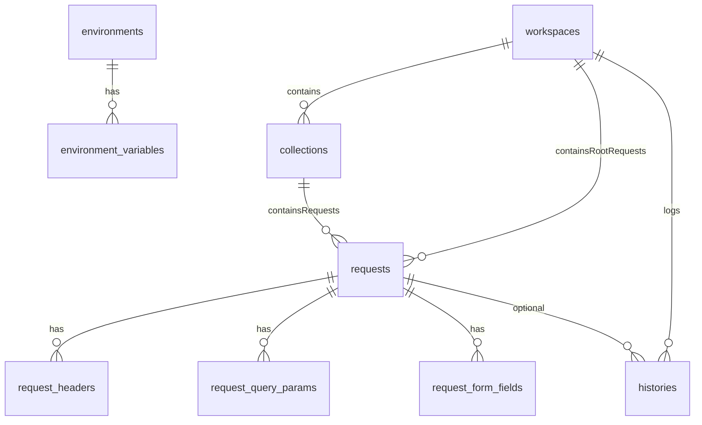

# Data model — chốt DB trước khi code (PostmanJanai)

## Nguyên tắc

- **Bước 0 (bắt buộc):** thống nhất **cấu trúc bảng/cột/ràng buộc** dưới đây; chỉ sau khi bạn “sign-off” mới:
  - chỉnh `ent/schema/*.go` + `go generate`,
  - cập nhật `internal/entity`, repository/usecase,
  - nối UI / HTTP executor.
- **Không** mở rộng feature (HTTP, collection CRUD UI) cho đến khi schema DB đã khóa.

## Quy ước chung

- **PK / FK:** dùng **UUID** dạng **TEXT** 36 ký tự (RFC 4122 string), không dùng `int` autoincrement cho bảng domain mới.
- **Thời gian:** `created_at` / `updated_at` — `datetime` (Ent `time.Time`).
- **Tên workspace:** `UNIQUE` theo scope global (một app một file SQLite; sau này có thể siết thành unique per-user nếu multi-user).
- **Xóa theo cây:** `ON DELETE CASCADE` từ `workspaces` → (`collections`, `requests`) và từ `requests` → bảng con (header/query/form).
- **Environment sets:** scope **global app** (không gắn workspace ở giai đoạn này).
- **Secret storage (giai đoạn hiện tại):** lưu giá trị env **plain text** trong SQLite local.

---

## Bảng và quan hệ (mục tiêu)

### `workspaces`

| Cột | Kiểu | Ràng buộc |
|-----|------|-----------|
| `id` | TEXT | PK, UUID |
| `workspace_name` | TEXT | NOT NULL, **UNIQUE** (trim ở tầng app; DB optional thêm COLLATE NOCASE sau nếu cần) |
| `workspace_description` | TEXT | NOT NULL, default `''` |
| `created_at` | DATETIME | NOT NULL |

### `collections`

| Cột | Kiểu | Ràng buộc |
|-----|------|-----------|
| `id` | TEXT | PK, UUID |
| `workspace_id` | TEXT | NOT NULL, FK → `workspaces.id` CASCADE |
| `name` | TEXT | NOT NULL |
| `description` | TEXT | NOT NULL, default `''` |
| `created_at` | DATETIME | NOT NULL |

- **UNIQUE** (`workspace_id`, `name`) — tên collection không trùng trong cùng workspace.

### `requests`

Lưu “tài nguyên request” có thể nằm **trực tiếp trong workspace** hoặc nằm trong **collection folder**.

| Cột | Kiểu | Ràng buộc |
|-----|------|-----------|
| `id` | TEXT | PK, UUID |
| `workspace_id` | TEXT | NOT NULL, FK → `workspaces.id` CASCADE |
| `collection_id` | TEXT | NULL, FK → `collections.id` CASCADE |
| `name` | TEXT | NOT NULL |
| `method` | TEXT | NOT NULL, default `GET` |
| `url` | TEXT | NOT NULL |
| `body_mode` | TEXT | NOT NULL — enum logic: `none`, `raw`, `json`, `form`, `multipart` |
| `raw_body` | TEXT | NULL — dùng khi `raw`/`json` |
| `created_at` | DATETIME | NOT NULL |
| `updated_at` | DATETIME | NOT NULL |

- **UNIQUE** (`workspace_id`, `name`) cho request nằm trực tiếp ở root workspace (`collection_id IS NULL`).
- **UNIQUE** (`collection_id`, `name`) cho request nằm trong collection (`collection_id IS NOT NULL`).
- Ràng buộc logic ở tầng app/usecase: nếu có `collection_id` thì collection đó phải thuộc đúng `workspace_id`.

### `request_headers`

| Cột | Kiểu | Ràng buộc |
|-----|------|-----------|
| `id` | TEXT | PK, UUID |
| `request_id` | TEXT | NOT NULL, FK → `requests.id` CASCADE |
| `key` | TEXT | NOT NULL |
| `value` | TEXT | NOT NULL |
| `enabled` | BOOLEAN | NOT NULL, default true |
| `sort_order` | INTEGER | NOT NULL, default 0 |

- Index: (`request_id`, `sort_order`).

### `request_query_params`

| Cột | Kiểu | Ràng buộc |
|-----|------|-----------|
| `id` | TEXT | PK, UUID |
| `request_id` | TEXT | NOT NULL, FK → `requests.id` CASCADE |
| `key` | TEXT | NOT NULL |
| `value` | TEXT | NOT NULL |
| `enabled` | BOOLEAN | NOT NULL, default true |
| `sort_order` | INTEGER | NOT NULL, default 0 |

### `request_form_fields` (form-urlencoded & form-data tối giản)

Dùng một bảng cho cả hai: phân biệt bằng `mode` hoặc `part_kind`.

| Cột | Kiểu | Ràng buộc |
|-----|------|-----------|
| `id` | TEXT | PK, UUID |
| `request_id` | TEXT | NOT NULL, FK → `requests.id` CASCADE |
| `field_kind` | TEXT | NOT NULL — `urlencoded` \| `multipart` |
| `key` | TEXT | NOT NULL |
| `value` | TEXT | NULL — với multipart file sau này có thể tách bảng `request_attachments` |
| `enabled` | BOOLEAN | NOT NULL, default true |
| `sort_order` | INTEGER | NOT NULL, default 0 |

*(Multipart file lớn: Phase sau có thể thêm bảng `request_parts` hoặc lưu path trong AppDir — không chốt trong bước schema tối thiểu này trừ khi bạn muốn ngay.)*

### `histories` (**chỉ** khi một request được **chạy / gửi HTTP** — **chốt đầy đủ trong lần khóa DB này**)

**Quy tắc sản phẩm (không thuộc DDL nhưng bắt buộc ở tầng app):**

- **Có** insert một dòng `histories` khi người dùng thực hiện **Send / chạy request** (luồng thực thi HTTP: thành công HTTP, lỗi 4xx/5xx vẫn là response hợp lệ, hoặc lỗi mạng/timeout — nên lưu vết để debug).
- **Không** ghi history khi chỉ tạo/sửa/xóa workspace-collection-request, chỉnh env, hoặc lưu draft mà **chưa** gửi.

**Gắn với entity đã lưu hay không:**

- `request_id` **NULL** = lần gửi **ad-hoc** (nhập URL trên thanh request chưa map tới bản `requests` đã lưu), vẫn là một “lần chạy”, nên vẫn lưu history nếu có chính sách gửi nhanh.
- `request_id` **NOT NULL** = lần gửi phát sinh từ một **request đã lưu** trong DB (thường có `workspace_id` để filter theo workspace đang mở).

| Cột | Kiểu | Ràng buộc |
|-----|------|-----------|
| `id` | TEXT | PK, UUID |
| `workspace_id` | TEXT | NULL, FK → `workspaces.id` SET NULL *(context UI khi gửi; ad-hoc có thể NULL)* |
| `request_id` | TEXT | NULL, FK → `requests.id` SET NULL *(NULL = gửi không gắn bản saved request)* |
| `method` | TEXT | NOT NULL |
| `url` | TEXT | NOT NULL |
| `status_code` | INTEGER | NOT NULL *(có thể dùng 0 hoặc sentinel nội bộ nếu không có phản hồi HTTP — thống nhất ở usecase)* |
| `duration_ms` | INTEGER | NULL |
| `response_size_bytes` | INTEGER | NULL |
| `request_headers_json` | TEXT | NULL — snapshot JSON (mảng/object key-value) |
| `response_headers_json` | TEXT | NULL |
| `request_body` | TEXT | NULL |
| `response_body` | TEXT | NULL |
| `created_at` | DATETIME | NOT NULL |

**Lưu / xem lại (yêu cầu sản phẩm):**

- Mỗi lần chạy tạo **một dòng** `histories` chứa **snapshot đủ để đọc lại** lần gọi đó: method/url, header request & response (JSON), body request & response, status, thời lượng, size response (theo cột phía trên).
- **Xem lại theo workspace:** filter `workspace_id` (giữ ERD `workspaces → histories`).
- **Xem lại theo một request đã lưu:** filter `request_id` để có **chuỗi lịch sử** mọi lần Send của đúng request đó (bao gồm request/response từng lần).
- **Gửi ad-hoc** (`request_id` NULL): vẫn lưu snapshot tương tự; `workspace_id` giúp gom list trong sidebar workspace khi có context.

*Indexing gợi ý: `created_at` DESC cho list; index/filter `workspace_id`, `request_id`.*

### `environments` (global sets)

| Cột | Kiểu | Ràng buộc |
|-----|------|-----------|
| `id` | TEXT | PK, UUID |
| `name` | TEXT | NOT NULL, **UNIQUE** |
| `description` | TEXT | NOT NULL, default `''` |
| `is_active` | BOOLEAN | NOT NULL, default false |
| `created_at` | DATETIME | NOT NULL |
| `updated_at` | DATETIME | NOT NULL |

- Rule: chỉ có **1 environment active** tại một thời điểm (enforce ở tầng usecase/service; có thể thêm partial unique index sau).

### `environment_variables`

| Cột | Kiểu | Ràng buộc |
|-----|------|-----------|
| `id` | TEXT | PK, UUID |
| `environment_id` | TEXT | NOT NULL, FK → `environments.id` CASCADE |
| `key` | TEXT | NOT NULL |
| `value` | TEXT | NOT NULL *(plain text local ở giai đoạn này)* |
| `enabled` | BOOLEAN | NOT NULL, default true |
| `sort_order` | INTEGER | NOT NULL, default 0 |
| `created_at` | DATETIME | NOT NULL |
| `updated_at` | DATETIME | NOT NULL |

- **UNIQUE** (`environment_id`, `key`) để tránh key trùng trong cùng một env set.
- Index: (`environment_id`, `sort_order`).

---

## Diễn giải ERD (tóm tắt)

---

## Migration khỏi DB cũ (int PK)

- Tăng `constant.DBSchemaUserVersion` và trong `internal/dbmanage/data_migrate.go`:
  - backup file SQLite (đã có cơ chế),
  - tùy chọn: tạo bảng mới / copy dữ liệu workspace/history sang UUID (generate UUID mới, map old_id → new_id trong bảng tạm hoặc in-code),
  - **hoặc** lần đầu bump lớn: export tối thiểu JSON và import lại (nếu ít bản ghi).
- Điều này là **cùng nhịp** với merge Ent schema; không triển khai code cho đến khi bảng trên đã được bạn duyệt.

---

## Thứ tự thực hiện sau khi sign-off schema

1. Cập nhật Ent schema + generate.
2. Chạy hook migrate/backup theo `DBSchemaUserVersion`.
3. Repository/entity theo UUID và quan hệ FK.
4. Phase 1 HTTP runner + Wails DTO (sau khi DB đã ổn định).

---

## Trạng thái

- **`histories`:** chốt **đầy đủ** cột như bảng (đã xác nhận).
- **Đang chờ:** bạn sign-off cuối cùng trên toàn bộ các bảng/cột ở trên trước khi chỉnh Ent/code.

# Todos (lập lại từ kế hoạch tổng)

- [ ] Sign-off schema (tài liệu này)
- [ ] Ent schema + generate
- [ ] Migrate int→UUID / backup
- [ ] Thêm schema environments + environment_variables (global scope)
- [ ] Quy tắc active env duy nhất + resolve `{{var}}` trước khi gửi request
- [ ] Repository & DTO
- [ ] HTTP executor & UI
